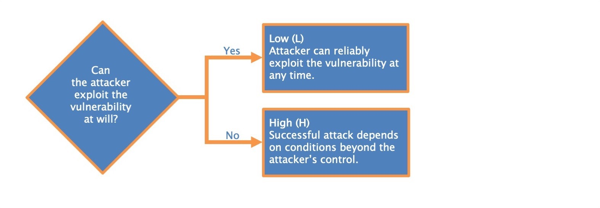
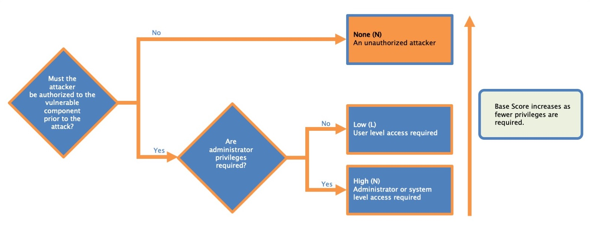
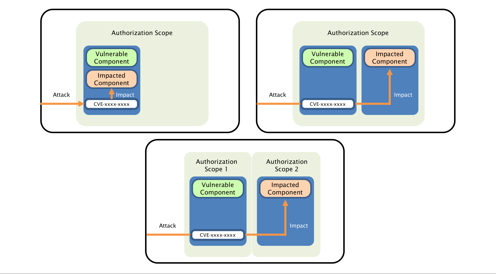
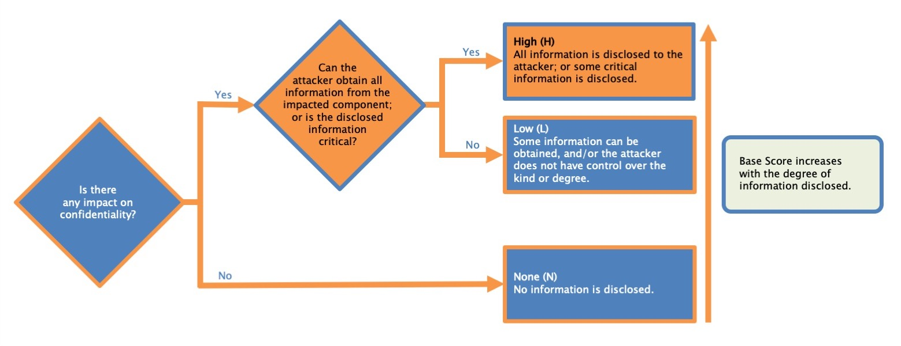

# cvss course

## Links

- [Severity Levels for Security Issues | Atlassian](https://www.atlassian.com/trust/security/security-severity-levels)
- <https://learning.first.org/courses/course-v1:FIRST+CVSSv3.1+2020/courseware/4cb813b88c7243e7a682470fd77bc61f/06c052ee2bf3459db35b3f491321f68a/?child=first#>!tab_17
- <https://nvd.nist.gov/vuln-metrics/cvss/v3-calculator>
- <https://learning.first.org/dashboard>
- [CVSS v3.1 Specification Document](https://www.first.org/cvss/specification-document)

## What is CVSS

CVSS stands for the Common Vulnerability Scoring System and is a vendor-agnostic, industry-open standard designed to convey vulnerability severity and help determine urgency and priority of response.

Currently maintained by Forum of Incident Response and Security Teams (FIRST)

## CVSS 3.1

- The language in CVSS version 3.1 has been updated to specify that a comprehensive risk assessment should employ more than a CVSS Base Score.
- CVSS v3.1 retains the CVSS v3.0 scoring framework while emphasizing that CVSS measures severity, not risk.
- The language in CVSS version 3.1 has been updated to specify that a comprehensive risk assessment should employ more than a CVSS Base Score.
- Updated the Scope explanation and the concepts of the impacted component and the vulnerable component
- Additional privileges assigned to the Impact metrics
- Additional guidance around scoring software libraries and vulnerability changes

## Terminology

B
Before we get further into the vulnerability, you need to know some key terminology:

The collection of privileges defined by a security authority when granting access to computing resources is the security scope.

> The vulnerable component is the thing that is vulnerable, and is typically a software application, module, driver, or possibly a hardware device.

## Attack Vector

This metric reflects the context by which vulnerability exploitation is possible.

- Network
- Adjacent
- Local
- Physical

## Attack complexity

- Low (L) Specialized access conditions or extenuating circumstances do not exist. An attacker can expect repeatable success when attacking the vulnerable component.

- High (H) A successful attack depends on conditions beyond the attacker's control. That is, a successful attack cannot be accomplished at will, but requires the attacker to invest in some measurable amount of effort in preparation or execution against the vulnerable component before a successful attack can be expected.[^2] For example, a successful attack may depend on an attacker overcoming any of the following conditions:
  - The attacker must gather knowledge about the environment in which the vulnerable target/component exists. For example, a requirement to collect details on target configuration settings, sequence numbers, or shared secrets.
  - The attacker must prepare the target environment to improve exploit reliability. For example, repeated exploitation to win a race condition, or overcoming advanced exploit mitigation techniques.
  - The attacker must inject themselves into the logical network path between the target and the resource requested by the victim in order to read and/or modify network communications (e.g., a man in the middle attack).

Low (L). Attacker can reliably exploit the vulnerability at any time

## Privileges Required

This metric describes the level of privileges an attacker must possess before successfully exploiting the vulnerability.

| Metric Value | Description |
| --- | --- |
| None (N) | The attacker is unauthorized prior to attack, and therefore does not require any access to settings or files of the vulnerable system to carry out an attack. |
| Low (L) | The attacker requires privileges that provide basic user capabilities that could normally affect only settings and files owned by a user. Alternatively, an attacker with Low privileges has the ability to access only non-sensitive resources. |
| High (H) | The attacker requires privileges that provide significant (e.g., administrative) control over the vulnerable component allowing access to component-wide settings and files. |

## User interaction

This metric captures the requirement for a human user, other than the attacker, to participate in the successful compromise of the vulnerable component. This metric determines whether the vulnerability can be exploited solely at the will of the attacker, or whether a separate user (or user-initiated process) must participate in some manner

| Metric Value | Description |
| --- | --- |
| None (N) | The vulnerable system can be exploited without interaction from any user. |
| Required (R) | Successful exploitation of this vulnerability requires a user to take some action before the vulnerability can be exploited. For example, a successful exploit may only be possible during the installation of an application by a system administrator. |

## Scope

Regarding vulnerable components and impacted components:

A vulnerable component is the thing that is vulnerable; also it’s the security scope that contains the vulnerability.
An impacted component is the thing that suffers the impact; also it’s the security scope that is affected by the vulnerability.

When a vulnerability in a component governed by one security authority is able to affect resources governed by another security authority, a Scope change has occurred. Vulnerable component (web application) is also an impacted component. Sope is unchanged.

The following example vulnerabilities look at different aspects of scoring Scope:

1. A vulnerability in a virtual machine that enables an attacker to read and/or delete files on the host operating system (perhaps even its own virtual machine) is considered a Scope change. In this example, there are two separate security authorities: one that defines and enforces access control for the virtual machine and its users, and another that defines and enforces access control for the host system within which the virtual machine runs.
2. A Scope change occurs when a vulnerability in a web application impacts user clients, e.g., web browsers. Common vulnerabilities of this type include cross-site scripting and URL redirection. The vulnerability is in the web application, but there is an impact to the data/behavior of the victim users’ web browsers, which are within a different security scope.
3. A SQL injection vulnerability in a web application is not usually considered a Scope change assuming the credentials are shared between web application and impacted SQL database, and therefore they are part of the same security scope.
4. A vulnerability that crashes a web server or SSH server is not considered a Scope change since the impact is limited only to the service provided by the affected server. The impact on users is secondary and is not considered a Scope change as users are not considered components.
5. A vulnerability that permits an attacker to exhaust a shared system resource, such as filling up a file system, should not be considered a Scope change as the attacker is still acting under the usual capabilities of the application and not breaching any security boundary.
6. By exploiting a vulnerability in an application that allows users restricted access to resources shared with other components across multiple security scopes (e.g., operating system resources such as system files), an attacker can access resources that they should not be able to access. Since there is already a valid path across the trust boundary, there is no Scope change.

Example:

> Karen works on the computer security incident response team (CSIRT) for an international bank. She gets an email from a constituent showing that the bank's website is vulnerable to reflected cross-site scripting (XSS). A successful attack requires an attacker to trick a legitimate bank user into browsing to a specific URL. This URL points to the bank's website, but it contains malicious URL parameters that trigger the vulnerability.
>
> The malicious code is only able to access information associated with the bank's vulnerable web site due to Same Origin Policy (SOP) restrictions in web browsers.
>
> What is the Scope metric value Karen assigns?
>
> Answer:
> The vulnerable component is the web server vulnerable to cross-site scripting, and the impacted component is the victim's browser, so the Scope is Changed. The vulnerable component and the impacted component are not the same thing, so the Scope cannot be Unchanged.

## Confidentiality - impact metric

The Confidentiality Requirement of a system should be based on the classification level of the data that is stored or used by the user and/or applications running on the target system. Encryption of the data at rest on this device should also be taken into consideration when establishing the Confidentiality Requirement. Data that passes through a device without being consumed or processed (e.g., a switch or firewall) should not be taken into consideration when assessing this attribute. See below for examples.

Note: The volume of data may influence the value of the attribute, but should not have as much impact as the classification (i.e., type) of data that is being stored or used.

A device that stores data classified at the highest level should have this attribute rated as High. However, if the sensitive data is encrypted at rest, this attribute may be rated Medium.

A device that stores data classified as non-public but not as high as the highest level should have this attribute rated as Medium. However, if the sensitive data is encrypted at rest, this attribute can be rated Low.

A device that stores data that can be openly shared publicly should have this attribute rated as Low.

Network equipment such as a router, switch, or firewall will generally be rated as Medium due strictly to the sensitivity of information such as routing tables, etc.

Any system that stores login credentials without encryption should have this attribute rated as High. This includes service accounts and credentials embedded into scripts or source code.

| Metric Value | Description |
| --- | --- |
| High (H) | There is a total loss of confidentiality, resulting in all resources within the impacted component being divulged to the attacker. Alternatively, access to only some restricted information is obtained, but the disclosed information presents a direct, serious impact. For example, an attacker steals the administrator's password, or private encryption keys of a web server. |
| Low (L) | There is some loss of confidentiality. Access to some restricted information is obtained, but the attacker does not have control over what information is obtained, or the amount or kind of loss is limited. The information disclosure does not cause a direct, serious loss to the impacted component. |
| None (N) | There is no loss of confidentiality within the impacted component. |

## Integrity - impact metric

This metric measures the impact to integrity of a successfully exploited vulnerability. Integrity refers to the trustworthiness and veracity of information. The Base Score is greatest when the consequence to the impacted component is highest. The list of possible values is presented in Table 7.

| Metric Value | Description |
| --- | --- |
| High (H) | There is a total loss of integrity, or a complete loss of protection. For example, the attacker is able to modify any/all files protected by the impacted component. Alternatively, only some files can be modified, but malicious modification would present a direct, serious consequence to the impacted component. |
| Low (L) | Modification of data is possible, but the attacker does not have control over the consequence of a modification, or the amount of modification is limited. The data modification does not have a direct, serious impact on the impacted component. |
| None (N) | There is no loss of integrity within the impacted component. |

## Availability impact - impact metric

This metric measures the impact to the availability of the impacted component resulting from a successfully exploited vulnerability. While the Confidentiality and Integrity impact metrics apply to the loss of confidentiality or integrity of _data_ (e.g., information, files) used by the impacted component, this metric refers to the loss of availability of the impacted component itself, such as a networked service (e.g., web, database, email).

Since availability refers to the accessibility of information resources, attacks that consume network bandwidth, processor cycles, or disk space all impact the availability of an impacted component.

The Base Score is greatest when the consequence to the impacted component is highest. The list of possible values is presented in Table.

| Metric Value | Description |
| --- | --- |
| High (H) | There is a total loss of availability, resulting in the attacker being able to fully deny access to resources in the impacted component; this loss is either sustained (while the attacker continues to deliver the attack) or persistent (the condition persists even after the attack has completed). Alternatively, the attacker has the ability to deny some availability, but the loss of availability presents a direct, serious consequence to the impacted component (e.g., the attacker cannot disrupt existing connections, but can prevent new connections; the attacker can repeatedly exploit a vulnerability that, in each instance of a successful attack, leaks a only small amount of memory, but after repeated exploitation causes a service to become completely unavailable). |
| Low (L) | Performance is reduced or there are interruptions in resource availability. Even if repeated exploitation of the vulnerability is possible, the attacker does not have the ability to completely deny service to legitimate users. The resources in the impacted component are either partially available all of the time, or fully available only some of the time, but overall there is no direct, serious consequence to the impacted component. |
| None (N) | There is no impact to availability within the imp |

The Confidentiality Impact and Integrity Impact metrics measure, respectively, the loss of confidentiality and integrity of data used by the impacted component. The Availability Impact metric measures the loss of availability of the impacted component itself.

## Temporal Metrics, Environmental Metrics, and Vector String
 

## Exploit Code Maturity (E)

- The Base Metric group represents the intrinsic characteristics of a vulnerability that are constant over time and across user environments. 
- The Temporal Metric group reflects the characteristics of a vulnerability that may change over time but not across user environments. 
- The Environmental Metric group represents the characteristics of a vulnerability that are relevant and unique to a particular user’s environment. 

This metric measures the likelihood of the vulnerability being attacked, and is typically based on the current state of exploit techniques, exploit code availability, or active, “in-the-wild” exploitation. Public availability of easy-to-use exploit code increases the number of potential attackers by including those who are unskilled, thereby increasing the severity of the vulnerability. Initially, real-world exploitation may only be theoretical. 

Publication of proof-of-concept code, functional exploit code, or sufficient technical details necessary to exploit the vulnerability may follow. Furthermore, the exploit code available may progress from a proof-of-concept demonstration to exploit code that is successful in exploiting the vulnerability consistently. In severe cases, it may be delivered as the payload of a network-based worm or virus or other automated attack tools.

| Metric Value | Description |
| --- | --- |
| Not Defined (X) | Assigning this value indicates there is insufficient information to choose one of the other values, and has no impact on the overall Temporal Score, i.e., it has the same effect on scoring as assigning High. |
| High (H) | Functional autonomous code exists, or no exploit is required (manual trigger) and details are widely available. Exploit code works in every situation, or is actively being delivered via an autonomous agent (such as a worm or virus). Network-connected systems are likely to encounter scanning or exploitation attempts. Exploit development has reached the level of reliable, widely available, easy-to-use automated tools. |
| Functional (F) | Functional exploit code is available. The code works in most situations where the vulnerability exists. |
| Proof-of-Concept (P) | Proof-of-concept exploit code is available, or an attack demonstration is not practical for most systems. The code or technique is not functional in all situations and may require substantial modification by a skilled attacker. |
| Unproven (U) | No exploit code is available, or an exploit is theoretical. |