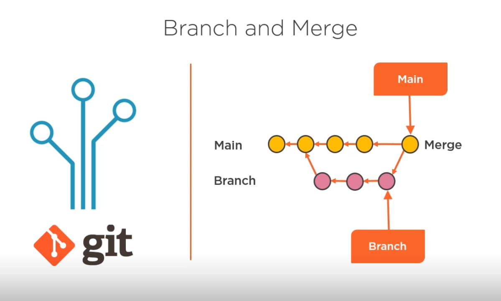
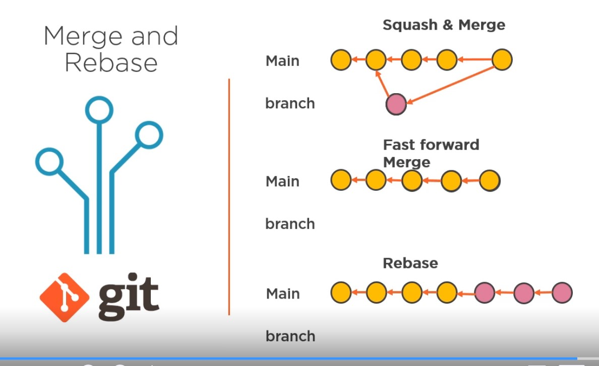

# AZ-400 Microsoft DevOps Solutions: Developing a Modern Source Control Strategy

## Links

- [Microsoft DevOps Solutions: Developing a Modern Source Control Strategy | Pluralsight](https://app.pluralsight.com/library/courses/microsoft-devops-solutions-developing-modern-source-control-strategy/table-of-contents)

## Developing a modern source control strategy

### What is considered modern?

- centralized
- distributed (Git)

Azure Devops supports both.

Git - commits applied to local repo. Pushing to central repo makes changes available for other team members.

### Differences

Centralized (SVN, Source Safe, TFS)

- scales to very large code bases
- fine level permission control
- allow usage monitoring
- lock files exclusively

Distributed (Git, Mercurial) - considered a modern SC strategy

- full offline experience and speed
- complete repository with portable history
- cross-platform
- growing usage in the market
- pull requests for code review

### Migrating to GitHub or Azure Devops

- tip migration often enough (no full history)
- enable git credential manager
- remove old files linked to old version control system
- create/update .gitignore, .gitattributes
- use suggested .gitignore files

### Setting new github repository and gitignore file

1. Create git repo and gitignore file

```
git init project 
git add *
# remove all added files
git rm --cache *
git status 
# clean, nothing staged
# go to github/gitignore > select your gitignore file, copy as raw 
notepad .gitignore 
# paste gitignore content
git add *
git commit -m "Initial"
```

2. Create GitHub repo
3. Add remote

```bash  

git remote add origin http://github...

```

4. Rename branch

```bash
git branch -M main

```

5. Push to remote

```git push -u origin main

```

### Supported migrations and Git Sub Modules

GitHub:

- Git
- Subversion
- Mercurial
- TFS

Azure DevOps

- TFS server
- Azure DevOps server

Subtree
Is a copy of repository pulled into parent repo. Easier to pull and harder to push.

Submodule
A pointer to a specific commit in anther repository. Easer to push but harder to pull.

### Manage and store large files in git repo

Do not commit

- outputs produced by build
- large and frequently changed binary files (images, videos)
- compressed archives (use individual files instead)

Git LFS

- LFS is extension to git
- Stores binary files in separate remote storage
- keeps standard Git workflow
- no limitations in size

Limitations

- every client used by team must install Git LFS client and configure correctly
- no  merge possible for binary files

eExample

```bash

git clone 

# add large video file  

git status 

git add * 

git status 

git commit -m "Add large "

git push 

# will give error due to large file and provide git LFS url 

# remote is not updated
# install git-lfs.github.com

git reset --soft HEAD~1

# video file is not staged

git lfs install 
git lfs track *.mp4

# gitattributes file gets updated

git add *
git commit -m "Add large LFS"
git push
```

### Cross repository sharing

Package management solutions

- NPM (Nodejs)
- Maven (Java)
- NuGet (.NET)
- Ruby Gems (Ruby)

Means your software  depends on external tools (package version)

Package management solutions

- GitHub, Azure DevOps Artifacts
- Upstram Proxy

Keep versions up to date

- NuKeeper
- Dependabot

### Implement workflow hooks  

Azure Devops

- Send SOAP request on specified events
  - Build, Repo, Extensions, Pipelines, releases, Work

GitHub

- Sends  HTTP Post to registerd endpoint
  - Issues, Repo, Actions, Security

GitHub Actions

- YAML definitions
- CI/CD workflows
- PR workflow validations
- Security scanning (detect access tokens)

### Implement CI/CD with  GitGHub actions

1. GitHub > Actions > Create workflow
2. Update workflow file using `${{github.workspace}}`: Build, Test,
3. Add Publish step
4. Add Deploy step. Use `env.WEB_APP_NAME`, webap package name from previous step, secrets
5. Add env.AZURE_WEBAPP_NAME at the top of yaml file
6. Create web app name in Azure using Azure cli
7. Create resource group
8. Create web app using resource group

### Implementing Azure DevOps Yaml Pipelines

1. Create new project in Azure org
2. Repos > Copy command to add to remote `git remote add azdo https ....`. Replace origin with azdo
3. Push to Azure devops
4. Update and commit app from Azure
5. Pipelines > Create Azure pipeline
6. Select your repo > Select your project
7. Edit pipeline yaml
8. Add task: Azure app service deploy
9. Select ARM, Subscription, app name
10. Save and run pipeline
11. Job > grant permission

## Planning and implementing branching strategies

### Understanding Git

- graph of nodes
- every commit has a pointer to its parent
- references make commits reachable: head, tag, branch

initial commit (data) <- commit1 (data) <- head

Basic commands

clone - pull down all data to local repo
stage - indicating that you want changes to become the next node in the graph
commit - commit staged changes to local repo
push - to move local changes to central server
pull - to get changes from server to local repo; can only pull when there are no local changes (unstaged) in local repo

### Using pull requests

Ensure code is reviewed before committed.
Ensure quality gates.

- CI/CD build
- unit tests

### What is branch?

Enables to work in isolation from others.
Branches have a traceable history to their parents.

### Branch and merge

Merge node allows tracing changes back to Main and Branch.



### Merge and rebase

Squash - can be used to merge changes from branch back to source branch so that individual commits are not visible (made in branch). All commits in branch are squashed in one node.



Rebase - catch up with changes in main branche before merging.

### Merge commit

```
create feature01 from master 
switch to feature-01
add changes 1
commit
add change 2
commit
create pull request
checked - no merge conflicts
review PR 
complete PR (no fast forward)

```

## Fast forward merge

```
create feature02 from master
add changes 1 
commit 
add change 2
commit
create pull request
checked - no merge conflicts
review PR 
complete > squash commit (there will be no merge node after commit)

```

## Rebase  

```
create feature03-rebase-branch from master
add changes 1 
commit 
add change 2
commit
switch to master branch
add change 3
commit
switch to feature03-rebase-branch branch
add change 4
commit
create pull request
checked - no merge conflicts
review PR 
complete > rebase and fast-forward (replaying your commits on new changed master branch)

```

## Using Git tags

Tags are alternative way to define pointers to nodes inb commit history. Tag points to specific point in history of the tree commit node.

- Often used to mark release

Lightweight - pointer to specific commit
Annotated tag - contains more information. Tagger, message and time.

## Branching strategies 

1. Git flow - low deployment frequency 
2. Git hub flow - high deployment frequency 
3. Trunk based development - high deployment frequency (deploy to prod almost every commit)


## Git flow overview 

Use a central server model, called Origin 

continue https://app.pluralsight.com/course-player?clipId=28d08ca7-0771-4c5a-aaf6-9ededfaa9101